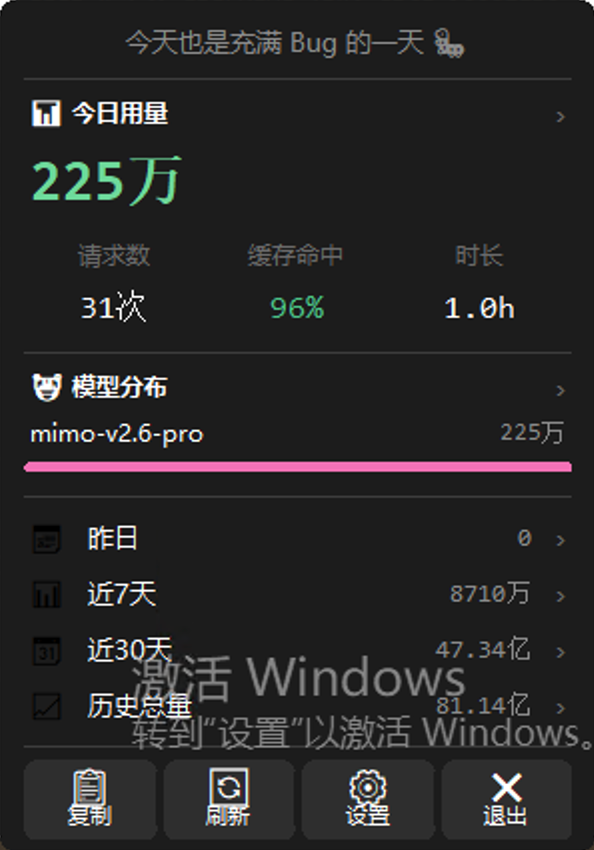
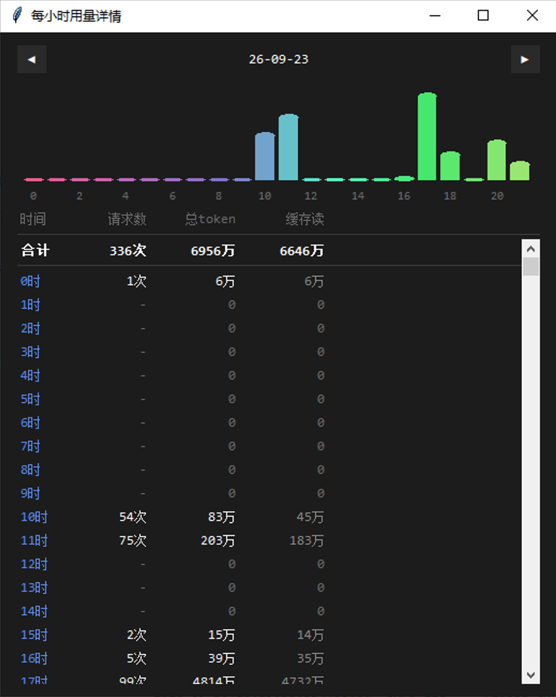

# ccBar Windows

Windows 系统托盘 AI CLI 用量统计工具，支持**多数据源**聚合——内置 [cc-switch](https://github.com/farion1231/cc-switch)（Claude/Codex 等多应用代理统计）、ZCode 与 Trae，后续可插拔扩展。
与 macOS 版（[ccbar-native](https://github.com/bmfish/ccbar-native)）**功能对齐**：洞察中心（费用 / 洞察 / 分享 / 渠道 / 流水 / 积分）、用量周报、主题与双语、多机合并等。

  

<p align="center">
  
  <br/>
  
  
</p>

> 截图取自早期版本；洞察中心 / 主题 / 双语 / 积分页的新截图待补（Windows 上直接截即可）。

## English

ccBar is a Windows system tray app that tracks your AI CLI token usage in real time — today, this week, and all-time — with **pluggable data sources**: [cc-switch](https://github.com/farion1231/cc-switch) (Claude Code / Codex / OpenCode via proxy), ZCode (GLM) and Trae. History is synced daily into a local SQLite store (source databases are opened read-only and never modified), while today's numbers are queried live.

Feature parity with the macOS build ([ccbar-native](https://github.com/bmfish/ccbar-native)): a six-page insights center (cost / insights / share / channels / timeline / credits), an auto-generated weekly usage report, six built-in themes plus importable JSON theme packs, a Chinese/English UI, idempotent CSV export/import, database merging across machines, daily rotating backups, and Trae usage via its official HTTP API.

## 安装

### 一键安装（PowerShell）

```powershell
irm https://raw.githubusercontent.com/bmfish/ccbar-win/master/install.ps1 -OutFile $env:TEMP\install-ccbar.ps1; & $env:TEMP\install-ccbar.ps1
```

### 手动安装

从 [Releases](https://github.com/bmfish/ccbar-win/releases) 下载 `ccBar.exe` 和 `install.ps1`，放在同一目录，右键 `install.ps1` → 使用 PowerShell 运行。

或直接把 `ccBar.exe` 复制到 `%LOCALAPPDATA%\ccBar\` 双击启动。

### 从源码运行

```bash
pip install -r requirements.txt
python main.py
```

### 打包 exe

```bash
pip install pyinstaller
pyinstaller --onefile --noconsole --name ccBar --icon ccBar.ico --add-data "ccBar.ico;." main.py
```

或直接双击 `build.bat`（Windows）。产物在 `dist/ccBar.exe`。

## 功能

与 macOS 版（[ccbar-native](https://github.com/bmfish/ccbar-native) v1.8.2）功能对齐：

- **托盘**：标题实时显示今日 token，图标按用量阈值变色（绿 → 黄 → 橙，超过 8000 万标红）；
  单次刷新增量达到「红色门槛」立即标红（可关）
- **弹窗面板**：今日卡片（请求数 / 缓存命中 / 工时 / 今日积分）、模型分布、今日每小时折线、
  趋势（昨日 / 近 7 天 / 近 30 天 / 历史总量）、按当前速率的 24 点预测、今日会话数
- **详情窗口**：每小时 / 近 7 天 / 近 30 天 / 模型分布（按渠道分组）/ **历史总量（按月汇总）**，
  带统计卡、峰值高亮、图表拖选读数、窗口位置记忆，全部支持导出 CSV
- **洞察中心**（六页）：
  - 费用：今日 / 7 天 / 30 天费用、**月度预算进度与日预算虚线**、模型费用排行、
    **性价比榜（token / $1）**、**未计费渠道按默认单价估算**（实测 $a · 估算 $b）
  - 洞察：连续使用 / 今日会话 / 本周用量（周环比）/ 日均 / 历史总量 / 单日峰值 / 最活跃时段 /
    最大模型 / 预计本月消耗、**星期分布（近 90 天）**、**90 天用量热力图**（悬停读数）、
    **模型编年史**（含自动 / 手动合并同名模型）、**导出长图**
  - 分享：**今日战报卡**与**上周周报卡**实时预览，均内嵌 GitHub 二维码，可保存为图片 /
    复制到剪贴板 / 打开周报目录
  - 渠道：近 30 天渠道与应用堆叠、Token 构成、缓存命中率、今日各渠道
  - 流水：**任意日期回看**（‹ / 日期 / › / 今天），按渠道与模型筛选，**导出 CSV**
  - 积分：今日 / 7 天 / 30 天积分、**官方账单余额**、近 30 天积分走势（Trae 口径）
- **周报**：每周一自动生成上周用量周报 PNG 到 `~/Documents/CCBar 周报/`，
  周一没开机则下次启动/刷新自动补生成（文件存在即幂等），生成后弹系统通知
- **通知**：用量预警阈值、每累计 N 万 token 里程碑（0 = 关闭，间隔可配）
- **多数据源**：cc-switch / ZCode / **Trae**，各自可启停、自定义路径；路径保存前即时校验
- **主题**：6 套内置配色（默认 / 卡哇伊 01 / 海蓝 / 翠绿 / 星空紫 / CRT 终端），
  JSON 主题包导入 / 导出 / 重命名 / 删除，与 macOS 版主题包互通
- **双语界面**：中文 / English / 跟随系统
- **数据安全**：每天自动备份统计库（滚动保留 7 份）+ 一键手动备份；
  明细 CSV 幂等导入导出（主键去重，重复导入零新增），兼容旧版 12 列 CSV；
  **多机合并**（导入另一台机器的 `ccbar.db`，按主键去重）；
  外部源库**全程只读**（`tests/test_invariants.py` 用字节哈希 + mtime + 行数锁住该约束）

## 数据架构

ccbar 自带统计库（`~/.ccbar/ccbar.db`），对外部源库**全程只读**：

```
自建库（主连接）
 ├── usage_log   统一明细表（昨天及更早的历史 + Trae 全部会话快照）
 ├── daily_agg   每日聚合缓存（区间/总量/按月查询直接读它，补账时窗口重算）
 ├── meta        各源同步水位 / Trae 登录态与积分账单
 └── usage_all   临时视图 = 自家历史 + 各源"今日"实时数据
      ├── ATTACH ~/.cc-switch/cc-switch.db   (只读)
      └── ATTACH ~/.zcode/cli/db/db.sqlite   (只读)
```

- **历史**（昨天及更早）：每日首次刷新自动补账进自家库，源库清理不影响已有统计
- **今日**：每次刷新实时查各源库汇总，零延迟；`daily_agg` 永不包含今天
- **Trae**：本地库是 SQLCipher 加密的，改走官方 HTTP 用量接口（登录态在设置里粘 sessionid，
  自动换签续期），会话快照 UPSERT 幂等，0–9 点静默

| 数据源 | 口径 | 默认 |
|---|---|---|
| cc-switch | input + output + 缓存读 + 缓存创建（全量，费用按 cc-switch 记录的单价折算） | 启用 |
| ZCode | input + output（与 ZCode 官方统计一致，可直接对账；官方未计费，可用默认单价估算） | 关闭，设置中勾选 |
| Trae | 净输入（input = 总量 − 缓存命中）+ output；积分为官方计费口径 | 关闭，需填 sessionid |

新增数据源：实现 `stats_store.py` 里的 `SourceAdapter` 并注册到 `SOURCE_REGISTRY` 即可
（同步、视图、设置界面自动生效）。

## 数据源路径

- cc-switch：`~/.cc-switch/cc-switch.db`（可在设置中修改）
- ZCode：`~/.zcode/cli/db/db.sqlite`（可在设置中修改，默认未启用）
- Trae：无本地库，走 `https://api.trae.cn` 官方接口（需在设置里粘贴 sessionid）

自动识别失败时在设置中手动指定。所有源库都以 `mode=ro` 只读挂载。

## 设置存储

`~/.ccbar/settings.json`（JSON，21+ 个键）。老版本的 `~/.ccbar/settings.txt`
会在首次启动时自动迁移（含 GBK/中文路径），迁移只跑一次。

## 开发与测试

```bash
pip install -r requirements.txt
python main.py

# 单元测试（无需 GUI，CI 上同理）
python -m unittest discover -s tests -v
```

测试覆盖数据层口径（补账/聚合/CSV 幂等/积分/模型合并/多机合并/自动备份）、
主题包往返、周报幂等、二维码黄金向量（开发期与 PyPI `qrcode` 逐模块比对 122 组）、
双语词条，以及真建 tkinter 窗口的冒烟测试（无显示环境自动跳过）。

## 版本

- **v1.7.0** — 功能对齐 macOS 版 v1.8.2：洞察中心补齐（月度预算 / 性价比榜 /
  星期分布 / 90 天热力图 / 模型编年史 / 长图导出 / 分享页双卡带二维码 / 流水任意日期回看 /
  页签记忆）、Trae 数据源与积分页、主题系统（6 套 + JSON 主题包）、中英双语、
  周报自动生成与错过补生成、每日自动备份轮转、多机合并、旧 12 列 CSV 兼容；
  修复洞察中心因 `@_on_gui` 误装饰与页签未注册而整体不可用、`daily_agg` 陈旧行、
  导入后事务未提交导致备份失败、模型分布详情每个渠道只渲染最后一个模型、
  月末前后翻月崩溃等问题
- **v1.6.0** — 多数据源架构与 ZCode 接入、洞察中心五页、明细 CSV 幂等导入导出、
  每日聚合缓存、自动备份与检查更新

## License

MIT
