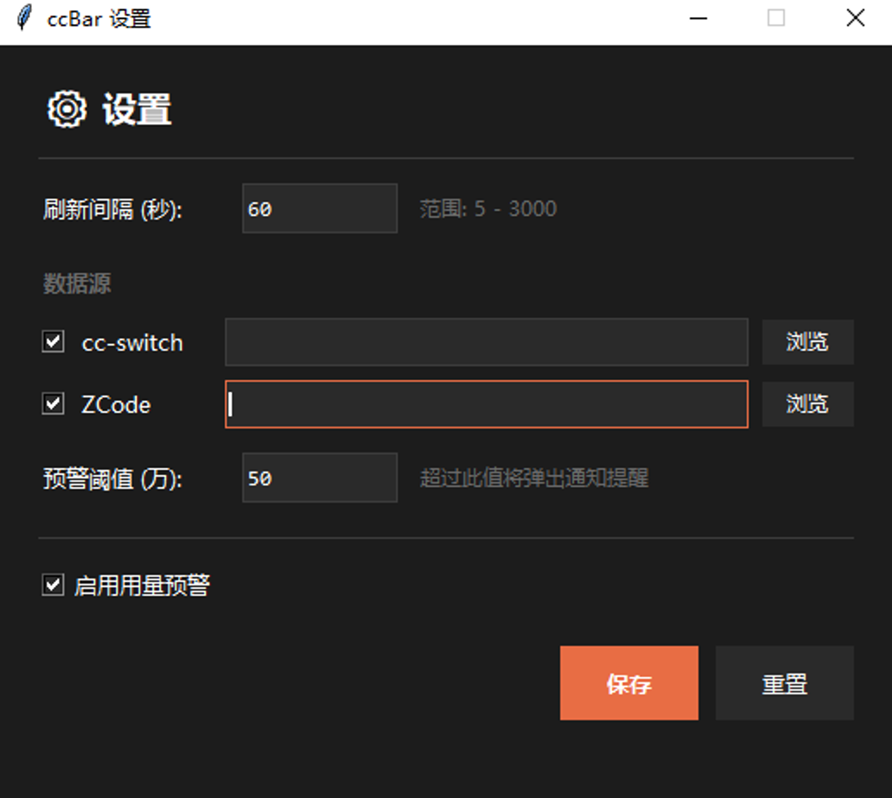

# ccBar Windows

Windows 系统托盘 AI CLI 用量统计工具，支持**多数据源**聚合——内置 [cc-switch](https://github.com/farion1231/cc-switch)（Claude/Codex 等多应用代理统计）与 ZCode，后续可插拔扩展。与 macOS 版（[ccbar-native](https://github.com/bmfish/ccbar-native)）架构一致。

  

<p align="center">
  
  <br/>
  
  
  <br/>
  
</p>

## English

ccBar is a Windows system tray app that tracks your AI CLI token usage in real time — today, this week, and all-time — with **pluggable data sources**: [cc-switch](https://github.com/farion1231/cc-switch) (Claude Code / Codex / OpenCode via proxy) and ZCode (GLM). History is synced daily into a local SQLite store (source databases are opened read-only and never modified), while today's numbers are queried live. Tray icon changes color with usage, milestone toasts included. A native macOS menu bar version is available at [ccbar-native](https://github.com/bmfish/ccbar-native).

## 安装

### 一键安装（PowerShell）

```powershell
irm https://raw.githubusercontent.com/bmfish/ccbar-win/master/install.ps1 -OutFile $env:TEMP\install-ccbar.ps1; & $env:TEMP\install-ccbar.ps1
```

### 手动安装

从 [Releases](https://github.com/bmfish/ccbar-win/releases) 下载 `ccBar.exe` 和 `install.ps1`，放在同一目录，右键 `install.ps1` → 使用 PowerShell 运行。

或直接把 `ccBar.exe` 复制到 `%LOCALAPPDATA%\ccBar\` 双击启动。

### 从源码运行

```bash
pip install -r requirements.txt
python main.py
```

### 打包 exe

```bash
pip install pyinstaller
pyinstaller --onefile --noconsole --name ccBar --icon ccBar.ico --add-data "ccBar.ico;." main.py
```

或直接双击 `build.bat`（Windows）。产物在 `dist/ccBar.exe`。

## 功能

- 左键点击托盘弹出面板：今日用量 / 模型分布 / 近7天 / 近30天 / 历史总量
- 右键菜单：今日 / 昨日 / 近7天 / 近30天 / 历史 详情窗口（带柱状图、折线图、环形图）
- 模型分布详情（按天查看，环形图为整体分布，列表**按渠道分组**）
- 托盘图标随用量变色
- 设置：刷新间隔 / **数据源启停与路径**（cc-switch 默认启用、ZCode 默认关闭）/ 预警阈值

## 数据架构

ccbar 自带统计库（`~/.ccbar/ccbar.db`），对外部源库**全程只读**：

历史区间与总量查询走 `daily_agg` 每日聚合缓存（补账时同步维护），不再扫描明细表。
历史（昨天及更早）每日懒惰补账进自家库，今日实时查各源库汇总，
两段在 `usage_all` 视图拼接——源库清理不影响已有统计。

| 数据源 | 口径 | 默认 |
|---|---|---|
| cc-switch | input + output + 缓存（全量） | 启用 |
| ZCode | input + output（与 ZCode 官方统计一致，可直接对账） | 关闭，设置中勾选 |

新增数据源：实现 `stats_store.py` 里的 `SourceAdapter` 并注册到 `SOURCE_REGISTRY` 即可。

## 数据源路径

- cc-switch：`~/.cc-switch/cc-switch.db`（可在设置中修改）
- ZCode：`~/.zcode/cli/db/db.sqlite`（可在设置中修改，默认未启用）

自动识别失败时在设置中手动指定。

## 开发

```bash
pip install -r requirements.txt
python main.py
```

## License

MIT
